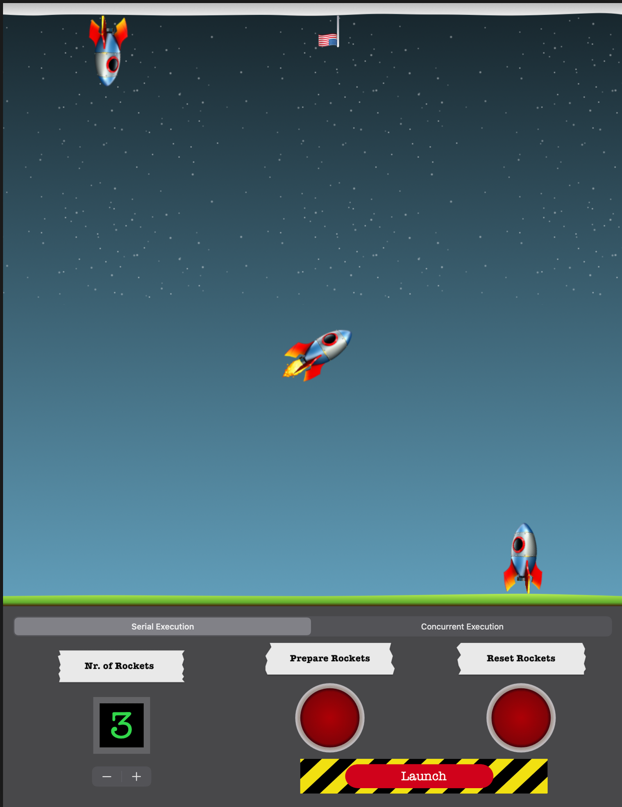

# Concurrency Launcher - a Swift Playground

This playground is created as part of my submission for the 2020 Swift Student Challenge.

The goal of this playground is to show and explain to the user how serial and concurrent queues work in Swift. This is achieved by an interactive window showing a launchpad. The user can select any number of rockets and the type of launch and view the effect of his/her choices.

## How to run?
This playground can be run on Swift Playgrounds 3.3 on iPadOS 13.4.1 and Swift Playgrounds 3.3 on macOS 10.15.4.

---

**Status of submission:** Accepted 🎉